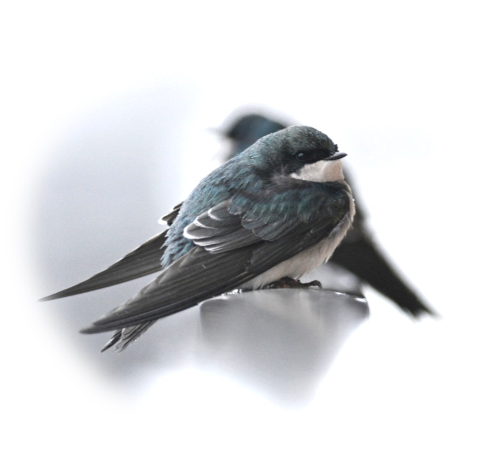
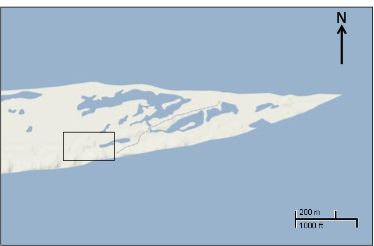
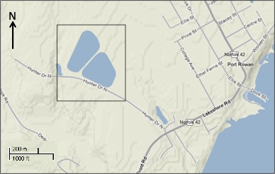
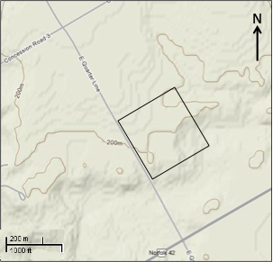
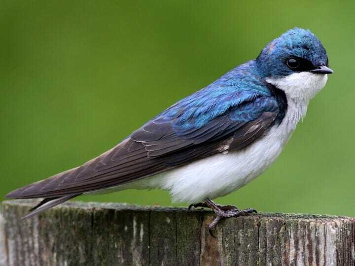
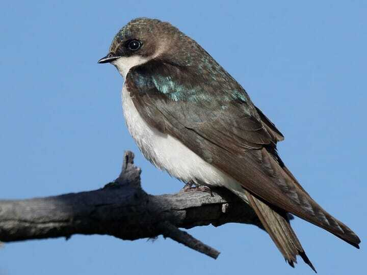

```{r setup, include=FALSE}
# DO NOT ALTER CODE IN THIS CHUNK
knitr::opts_chunk$set(echo = TRUE)
```

* * *
## Tutorial learning objectives

In this tutorial you will explore:

- Whether sexual dimorphism is present in a population of Tree Swallows found in Long Point, Ontario
- Life history traits of Tree Swallow
- Trade offs between the number of clutches a bird may have and the number of eggs in each clutch
- How the sampled population of Tree Swallow's birth rates have changed over time


* * *
## Background of datasets
This is a tutorial to get you familiar with R and explore ecological concepts through a Tree Swallow nest productivity dataset. Before we jump into the weeds, let's get to know our dataset!  

The Tree Swallow (*Tachycineta bicolor*) is one of the most common birds in eastern North America that normally nests in tree cavities excavated by other species like woodpeckers, but also readily accepts human made nest’ boxes. Based on this quality and their abundance, Birds Canada has monitored nest boxes of tree swallows around the Long Point Biosphere Reserve, Ontario, from 1974 to 2014. Each year, May through June, volunteer research assistants check nest box contents daily, and band the adults and their young. Nest-box records are available from about 300 boxes from 3-4 sites during this period. Data collected includes nest box observations, clutch initiation dates, clutch size and egg weight, nest success, weather, insect abundance, and banding data. This data set includes all data entry related to eggs, nests, nestlings, nest check observations, and banding data from 1977 to 2014. More information on this dataset can be found [here]("https://figshare.com/articles/dataset/Tree_Swallow_Nest_Box_Productivity_Dataset_from_Long-Point_Ontario_Canada_1977-2014_/14156801/1?file=26736347"). 

Additionally, in 2021, this dataset was quality checked and made open access by Jonathan Diamond through a Data Rescue internship with the [Living Data Project]("https://www.ciee-icee.ca/data.html"), an initiative through the Canadian Institute of Ecology and Evolution that rescues legacy datasets.  



Through Bird Studies Canada, Long Point Bird Observatory monitored three nest box "colonies" of Tree Swallows at Long Point, two on the "mainland" near Port Rowan (at the Port Rowan sewagelagoons and adjacent to agricultural land at mudd creek) and the third at the tip of the Point.

### The Point
This colony was established in its present location in 1969. The nest boxes are located about 1 kmwest of the Tip of the point and are arranged 24.4m apart in a grid of numbered (north-south) rows and lettered (east-west) columns. Each box is designated by its position, so box 10G is in row 10 and column G. At the present time the rows in use are 1-19 and the letters are D-K, but many positions are unfilled and there are a total of 64 boxes.



### The Sewage Lagoon
This colony was first established in 1977 and has since been expanded to a total of 77 boxes. The boxes are in two rows around the lagoon embankment, as well as across the street in a small cluster of 5 boxes.



### Mud Creek
Established in 1987, the Mud Creek site is located 3.25 km north-northeast of Sewage Lagoon and contains 80 nest boxes. The habitat is an open, uncultivated field adjacent to a small woodlot.



For this tutorial we will be looking at the banding dataset which adults were trapped sometime between the first young hatch and when they were 12 days old. All adult birds are banded, unless previously banded. It was also recorded if the bird had a brood patch (BP) or cloacal protuberance (CP). Plumage color was recorded as blue (BLU), Brown (BRN), or Intermediate (INT). Furthermore, plumage categories and age/sex designations were assigned and a variety of size measurements were taken: 

*Plumage Categories*
- BLU birds (ASY) – More than 90% of the upper parts iridescent blue-green
- INT birds (AHY) – More than 50% up to 90% of upper parts iridescent blue-green (remainder dull brown or brown tinged with green)
- BRN birds (SY) – Up to 50% of upper parts iridescent blue-green (remainder > 50% dull brown or brown tinged with green)

*Sex Categories*
- Male = M
- Female = F

*Measurements of Size and Weight*
- Wing chord length (mm) = wing_chord
- Wing chord flat (mm) = wing_flat
- Tail length (mm) = tail
- p_9 = primary feather length



Adults are blue-green above with white below with blacking flight feathers. Photo courtesy of Max Nootbaar from the [Macaulay Library]("https://macaulaylibrary.org/asset/101318791?__hstc=75100365.4b6645b395fc517502f8f060b03fdb13.1649426500778.1649426500778.1649426500778.1&__hssc=75100365.2.1649426500779&__hsfp=1238073771&_gl=1*1fqca32*_ga*NzI0MDM2MjY1LjE2NDk0MjY0OTg.*_ga_QR4NVXZ8BM*MTY0OTQyNjQ5OS4xLjEuMTY0OTQyNjU3Ny41OA..#_ga=2.227763358.2003098112.1649426500-724036265.1649426498").



First year females may be brownish above with hints of blue-green; adult females can be nearly blue-green as males. Photo courtesy of Matt Davis from the [Macaulay Library]("https://macaulaylibrary.org/asset/237909411?__hstc=75100365.4b6645b395fc517502f8f060b03fdb13.1649426500778.1649426500778.1649426500778.1&__hssc=75100365.3.1649426500779&__hsfp=1238073771&_gl=1*1n9uq65*_ga*NzI0MDM2MjY1LjE2NDk0MjY0OTg.*_ga_QR4NVXZ8BM*MTY0OTQyNjQ5OS4xLjEuMTY0OTQyNjg0Ni4yNg..#_ga=2.119171210.2003098112.1649426500-724036265.1649426498")


* * *
## Importing data and packages

In this tutorial, we will be working with Tree Swallow data collected by Bird Studies Canada, Long Point Bird Observatory as well as a few additional packages. Run the following code to import the required packages and pull in the dataset that we will be working with throughout this tutorial.
```{R}
library(dplyr)
library(ggplot2)
library(tidyr)
library(lubridate)
library(reshape)
library(readr)
library(ggpubr)

banding <- read.csv("TRES/banding_final.csv")
banding_nest <- read.csv("TRES/banding_nest_final.csv")
nest <- read.csv("TRES/nest_final.csv")

```


```{R}
# Now, we want to make sure the class of our data is correct before we move forward:
str(banding)
# lets go ahead and convert the sex and nest_box column class into factors:
banding$sex <- as.factor(banding$sex)
banding$nest_box <- as.factor(banding$nest_box)


str(banding_nest)
# fix class
banding_nest$sex <- as.factor(banding_nest$sex)
banding_nest$nest_box <- as.factor(banding_nest$nest_box)
banding_nest$location <- as.factor(banding_nest$location)

str(banding_nest)
# fix class
nest$nest_code <- as.factor(nest$nest_code)
nest$location <- as.factor(nest$location)
```

* * *
### Sexual dimorphism in tree swallows

**Sexual dimorphism** is defined as the phenotypic variations within different sexes of the same species (Andersson 1994). Differences can include size, weight, plumage (in birds). These differences are thought to arise through species that are part of a social mating system, in which there may be varying degrees of parental care (Darwin 1871; Wallace 1889; Anderson 1994). This phenomenon is often seen in birds, where males are the larger sex and have more ornate plummage than females. 

[]!(TRES/ornate.png)

Image from [ThoughtCo.]("https://www.thoughtco.com/peacock-facts-4690664").

***
**Questions**

*Why do you think this phenomenon happens?* 
*Why are females generally more drab?* 
*In which instance to you think females would be more ornate than males?* 
***

To determine if **sexual dimorphism** exists in this tree swallow data were will get you to explore the average size measurements taken for each bird. Since birds were tracked using a band number, and birds may have been captured multiple times throughout their life, so we will observe the differences in average size measurement taken for each bird.

```{R}
# look at the following variable to see how they differ by gender : wing_chord, tail, and weight

# will will take the mean of these measurements by band_number and gender

wing_chord <- aggregate(wing_chord ~ band_number + sex, banding, mean)


# Boxplot of these trends based on sex

ggplot(wing_chord, aes(factor(sex), wing_chord, fill=sex)) + 
  geom_boxplot() +
  scale_fill_manual("", values=c("M"= "lightskyblue", "F"= "plum3")) + 
  xlab('') +
  ylab('Wing Chord') +
  ggtitle("Wing Chord vs. Sex")


# Lets go ahead and try calculating the mean tail length by sex and band number and graph boxplots of these values:


#### these are the answers ###
tail <- aggregate(tail ~ band_number + sex, banding, mean)
weight <- aggregate(weight ~ band_number + sex, banding, mean)


ggplot(tail, aes(factor(sex), tail, fill=sex)) + 
  geom_boxplot() +
  scale_fill_manual("", values=c("M"= "lightskyblue", "F"= "plum3")) + 
  xlab('') +
  ylab('Tail') +
  ggtitle("Tail vs. Sex")

ggplot(weight, aes(factor(sex), weight, fill=sex)) + 
  geom_boxplot() +
  scale_fill_manual("", values=c("M"= "lightskyblue", "F"= "plum3")) + 
  xlab('') +
  ylab('Weight') +
  ggtitle("Weight vs. Sex")
```


Now, to get a sense of how much the wind chord length, tail length, and weight differs between male and female tree swallows lets find the mean value for each.

```{R}
# can calculate the mean female and male wing flat length like this (have been taugh this way) or could subset by sex and then calculate

wing_chord.avg <- aggregate(wing_chord ~ sex, wing_chord, mean)


tail.avg <- aggregate(tail ~ sex, tail, mean)
weight.avg <- aggregate(weight ~ sex, weight, mean)

wing_chord.avg
tail.avg
weight.avg

```


What is the average wing chord length, tail length, and weight of the male tree swallows?

** fill in the blank (current answer = 117.9625	, 55.69233, 20.46923) ***

What is the average wing chord length, tail length, and weight of the female tree swallows?

** fill in the blank (current answer = 113.5396, 54.26951	, 20.72255) ***

** fill in the blank (current answer = 117.4681, 55.73119, 20.37966) ***

What is the average wing chord length, tail length, and weight of the female tree swallows?

** fill in the blank (current answer = 113.1433, 54.49889, 20.64975) ***

Do these findings suggest that there is some level of sexual dimorphism in tree swallows?

What type of pressures could lead to sexual dimorphism in tree swallows?

** fill in the blank (e.g. sexual selection through female choice or male-male competition?) ***


* * *
## Aspects of Tree Swallow Life History

### Trade offs: Clutch size vs. clutch number?

```{R}
# to visualize whether there may be a trade off between clutch size and the number of clutches in a nest lets visualize these factors in a box plot
# the 'nest' dataset contains records of the clutch numbers found in nest boxes across Long Point dating back to 1987!

# lets take a quick look at the dataset first to figure out what we need to plot
head(nest)

# we want to look at how clutch size (clutch_size) may vary between the first and second clutch (clutch_number)

ggplot(nest, aes(factor(clutch_number), clutch_size)) + 
  geom_boxplot(outlier.colour="black", outlier.size=0.5, position = position_dodge(preserve = "single")) +
  xlab('') +
  ylab('Clutch Size') +
  ggtitle("Clutch Number vs. Clutch Size") +
  scale_y_continuous(breaks = seq(0, 13, by = 1)) +
  theme(plot.title = element_text(hjust = 0.5))


#  example on how to calculate the average clutch size for clutch number 1 and 2
aggregate(clutch_size ~ clutch_number, nest, mean )

```

What is the average clutch size for the first and second clutches?

** clutch 1 = 5.613377, clutch 2 = 4.796196	**

It appears that second clutches are slightly smaller than first clutches! However, in order to confirm that there is a statistically significant difference between the two clutch sizes you would need to complete some sort of statistical analysis (e.g a t-test).


### Do larger birds have bigger clutches?

```{R}
# is the size and weight of the bird at maturity related to the clutch size? Lets look at wing chord length, tail length, and bird weight to investigate this and lets separate our analysis my male and female birds

# First, lets find the mean wing chord length when grouped by year, nest_box, sex, clutch_number, clutch_size and band number

# wing_chord
banding_nest.wing_chord <- aggregate(wing_chord ~ year + sex + nest_box + clutch_number + band_number + clutch_size, banding_nest, mean)
# tail
banding_nest.tail <- aggregate(tail ~ year + sex + nest_box + clutch_number + band_number + clutch_size, banding_nest, mean)

# weight
banding_nest.weight <- aggregate(weight ~ year + sex + nest_box + clutch_number + band_number + clutch_size, banding_nest, mean)

# lets see if we see any patterns between the number of eggs there are per clutch (clutch_size) and the weight or size of the parent tree swallow

plot(clutch_size ~ wing_chord, banding_nest.wing_chord,
     main="Clutch Size vs Parent Wing Chord Length",
     pch=20,
     col=sex,
     xlab="Wing Chord Length (mm)", 
     ylab="Clutch Size")
legend("topright", legend= levels(banding_nest.wing_chord$sex),
       col= 1:2, pch = 20, cex=0.9)

plot(clutch_size ~ tail, banding_nest.tail,
     main="Clutch Size vs Parent Tail Length",
     pch=20,
     col=sex,
     xlab="Tail Length (mm)", 
     ylab="Clutch Size")
legend("topright", legend= levels(banding_nest.tail$sex),
       col= 1:2, pch = 20, cex=0.9)

plot(clutch_size ~ weight,banding_nest.weight,
     main="Clutch size vs Parent Bird Weight",
     pch=20,
     col=sex,
     xlab="Weight (g)", 
     ylab="Clutch Size")
legend("topright", legend= levels(banding_nest.weight$sex),
       col= 1:2, pch = 20, cex=0.9)
```


What is the average clutch size for the first and second clutches?

You may notices a trend, but in order to confirm this you would need to complete some sort of statistical analysis (e.g a t-test).


* * *
## Changes through time

Could bird communities be changing over time as a result of climate change or other environmental shifts? Lets observe if the average clutch size over time is changing.

```{R}
# first we want to take the average clutch size that was sampled from all of the nest boxes each year

nest.average <- aggregate(clutch_size ~ year, nest, mean)

lm_clutch_size <- summary(lm(clutch_size ~ year, data= nest.average))
r2_0 <- lm_clutch_size$r.squared # for R-squared labels
rlabel_0 <- bquote(italic(R)^2 == .(format(r2_0, digits = 3)))
plot(clutch_size ~ year, data=nest.average,
     main="Yearly Average Clutch Size over Time",
     pch=16,
     xlab="Year", 
     ylab="Yearly Average Clutch Size",
     cex.main=1.25, 
     cex.lab=1)
abline(lm(clutch_size ~ year, data=nest.average))
text(2010, 6.2, rlabel_0)
```

It may appear that the average clutch size is declining overtime however when looking at the R^2 value of this linear regression we can see that this relationship is not a strong one.


* * *
## Take-homes

After going through these data you have now had the opportunity to learn a bit about tree swallows, and more specifically look at a 'community' of tree swallows found in Long Point, ON. This population appeared to show signs of sexual dimorphism, where the male swallows had longer wing chords and tails and were heavier. As well, we noticed that there appeared t be a trade off between clutch size and the number of clutched in a nest. An important thing to not is that these relationships were speculative and statistical analyses will be required to support these findings in this population.

Lastly, these data did not show trends of larger birds having more eggs and we observed no conclusive temporal trends of changes in birth rates over time. It is not uncommon that data is collected with certain hypotheses in mind and trend or relationships are ultimately not found to support these hypotheses!


